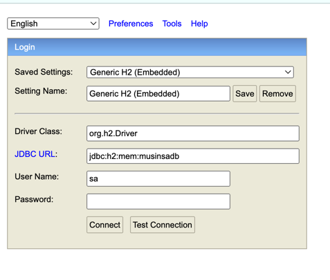

# musinsa-server

> ## Tech spec
> - Kotlin
> - Spring Jpa Data
> - Querydsl
> - H2 Database
> - Docker

# 빌드 방법

### Option 1) 직접 도커파일 빌드 후 도커 이미지 실행

```dockerfile
docker build -t musinsa-server .
docker run -p 8080:8080 musinsa-server
```

### Option 2) 쉘 스크립트 실행

```shell
chmod +x start.sh 
./start.sh
```

# DB 접속 방법

- 도커 빌드 및 컨테이너 실행 후 url 접속 : http://localhost:8080/h2-console/
- User Name : `sa`



# API 상세 설명

> ## 구현 1 - 카테고리 별 최저가 브랜드, 상품가격, 총액 조회 API

> ##### API : http://localhost:8080/category/lowest-price

- 브랜드별 카테고리의 상품이 품절되는 경우는 없다고 가정 (즉 카테고리별 최소 1개의 상품은 존재)
- 각 카테고리의 최저가에 해당되는 상품을 집계 후, 상품의 브랜드와 상품가(최저가) 를 리스트로 반환합니다.
- 상품 목록에 집계된 상품가를 모두 합산하여 상품 목록과 함께 리턴합니다.
- 화면단에서 api 응답값을 그대로 사용할 수 있도록 카테고리 값은 한글로 변환 후 응답, 상품 가격은 원(won) 단위에 맞게 변환.

### 예상 케이스

1. 동일한 최저가가 여러 브랜드에 존재하는 경우
    - 카테고리별 최저가 브랜드가 여럿일 경우, 이름 순으로 노출합니다.

### Response

| Field               | Type    | Description |
|---------------------|---------|-------------|
| products            | objects | 상품 목록       |
| products[].category | string  | 상품의 카테고리    |
| products[].brand    | string  | 상품의 브랜드 명   |
| products[].price    | string  | 상품 가격       |
| total_price         | string  | 상품 목록의 총액   |

> ## 구현 2 - 단일 브랜드로 모든 카테고리 상품 구매 시, 최저가에 판매하는 브랜드와 카테고리의 가격, 총액 조회 API

> ##### API : http://localhost:8080/brand/lowest-price

- 기본 구현 사항은 각 브랜드의 상품을 모두 더하여 가장 저렴한 브랜드를 선정합니다. 이는 카테고리별로 상품이 하나만 존재하는 경우를 가정합니다.
- 하지만 2가지 케이스에 대한 고려가 필요합니다.

### 예상 케이스

1. 브랜드 합산가(최저가)가 동일할 때
    - 이 경우에는 브랜드 이름 순을 기준으로 첫번째 브랜드를 응답합니다.
2. 단일 브랜드 내에서 하나의 카테고리가 2개 이상의 상품을 가질 때
    - 이 경우 각 브랜드의 모든 상품을 더하는 식으로 구현 시, 단일 카테고리의 상품을 여러개 구매하는 상황이 발생할 수 있습니다.
    - 때문에 동일 카테고리의 최저가 상품을 조회할 수 있는 쿼리를 구현하여 카테고리당 하나의 상품만 구매할 수 있도록 쿼리를 개선했습니다.

| Field               | Type    | Description        |
|---------------------|---------|--------------------|
| brand               | string  | 최저가 브랜드 이름         |
| products            | objects | 브랜드의 카테고리 및 상품가 목록 |
| products[].category | string  | 카테고리 이름            |
| products[].price    | string  | 상품가                |
| total_price         | string  | 해당 브랜드의 최저가 상품 합산가 |

> ## 구현 3 - 카테고리 이름으로 검색 시, 최저/최고 가격 브랜드와 상품 가격 조회 API

> ##### API : http://localhost:8080/price-range?categoryName={category}

### 예상 케이스

1. 동일한 최저가 또는 최고가를 가진 브랜드가 여러 개인 경우
    - 동일 가격인 상품이 2개 이상 존재시 브랜드명 순으로 반환
2. 요청된 카테고리가 존재하지 않는 경우 or 잘못된 카테고리를 요청한 경우
    - 400 에러 반환
3. 요청된 카테고리에 상품이 없는 경우
    - 유효한 카테고리로 요청했지만 상품이 없는 경우이므로 정상적인 api 요청으로 판단
    - `lowest_price`, `highest_price` 필드에 empty list 반환

### Request

| Field        | Type   | Description |
|--------------|--------|-------------|
| categoryName | string | 검색할 카테고리 명  |

### Response

| Field                 | Type             | Description                                               |
|-----------------------|------------------|-----------------------------------------------------------|
| category              | string           | Category name                                             |
| lowest_price          | array of objects | List of brands with the lowest price                      |
| lowest_price[].brand  | string           | Brand name offering the lowest price                      |
| lowest_price[].price  | string           | Price for the category by this brand (two decimal places) |
| highest_price         | array of objects | List of brands with the highest price                     |
| highest_price[].brand | string           | Brand name offering the highest price                     |
| highest_price[].price | string           | Price for the category by this brand (two decimal places) |

> ## 구현 4 - 브랜드 및 상품 추가 / 업데이트 / 삭제 API

> ##### `POST` | http://localhost:8080/management/products

- Request Body 의 `operation type` 값에 맞게 브랜드 및 상품을 생성/수정/삭제 할 수 있습니다.
- 브랜드와 상품 모두 변경이 필요하면 `brand_request` 와 `product_request` 값을 채워 요청을 전송합니다.
- 브랜드와 상품 개별적으로 변경 필요시엔 변경하고자 하는 request 객체(`brand_request` or `product_request`)의 값만 채워 보낼 수 있습니다.

### Request Body

| Field                      | Type    | Required | Description                                                 |
|----------------------------|---------|----------|-------------------------------------------------------------|
| operation_type             | string  | Required | 수행할 작업 Enum 입력 ("CREATE  / UPDATE / DELETE")                |
| brand_request              | object  | Optional | Request data related to the brand                           |
| brand_request.id           | integer | Optional | Unique identifier for the brand                             |
| brand_request.name         | string  | Optional | Name of the brand                                           |
| product_request            | object  | Optional | Request data related to the product                         |
| product_request.brand_id   | integer | Optional | Unique identifier for the brand associated with the product |
| product_request.product_id | integer | Optional | Unique identifier for the product                           |
| product_request.category   | string  | Optional | Category of the product (e.g., "TOP")                       |
| product_request.price      | integer | Optional | Price of the product in cents or major currency units       |
| product_request.deleted    | boolean | Optional | Indicates if the product is marked as deleted (true/false)  |

### Response Body

| Field   | Type   | Description          |
|---------|--------|----------------------|
| success | bool   | 성공 여부 리턴(true/false) |
| message | string | 성공 메시지 or 실패 사유 리턴   |
